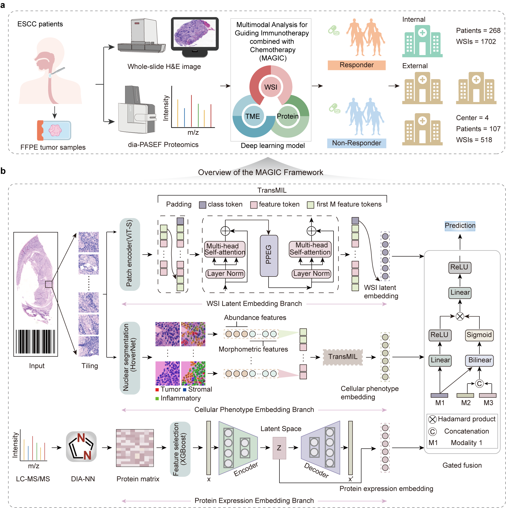

[# Multi-modal fusion-based deep learning model  for predicting the response to immunotherapy combined with chemotherapy in cancer](##)

[**MAGIC** - **M**ultimodal **A**nalysis for **G**uiding **I**mmunotherapy combined with **C**hemotherapy.](##)

MAGIC is a multimodal deep learning model to predict treatment response, here the response to immunotherapy combined with chemotherapy from digitized tumour slides (here H&E-stained) and protein expression profiles.

_MAGIC pipeline_

The repository contains:
* Code for extracting patch features
* Code for HoverNet-based cell segmentation and extraction of cellular phenotype features
* Code for preprocessing protein expression data
* Code for MAGIC construction 
* Code and instructions for training the model

The code is not intended to be a general-purpose library, but rather a record of the code that was used for the paper. To adapt this code for your own datasets or projects, appropriate modifications will be required. For instance, you will need to update hardcoded paths and adjust other parameters that are specific to the paper.

[## Code Examples](##)

### 1. Install dependencies

The below command creates an unnamed conda environment in your working directory.

`conda env create --prefix ./.conda -f environment.yml`

`conda activate ./.conda`

### 2. Patch feature extraction
`cd Lunit`

`python lunit.py --dataset PATCHES_DIR --output_folder OUTPUT_DIR`

### 3. Cellular Phenotype Feature Extraction
#### 3.1 Nuclei segmentation
Using Hover-Net(https://github.com/vqdang/hover_net) pretrained on PanNuke Dataset to segment nucleus in the HE patches, where the model weight file is saved in ./hover_net/hovernet_fast_pannuke_type_tf2pytorch.tar.

`cd HoverNet`

`python write_sh.py`

`cd ./hover_net`

`conda activate hovernet`

`chmod +x hovernet_sh.sh`

`./hovernet_sh.sh`

#### 3.2 Nuclei features extraction
`cd HoverNet`

`python nuclei_features_extraction.py`

#### 3.3 Nuclei features standardization

`python nuclei_features_standardization.py`

#### 3.4 Nuclei features selection

`python final_feature.py`

### 4. Protein expression preprocessing
`cd protein_process`

`python process_protein.py`

### 5. Training MAGIC
MAGIC takes as input bags of patch-level deep features and cellular phenotype features, alongside protein expression profiles, to predict treatment response. Hyperparameter configurations can be found in the folder "config.yaml". 

`python train.py --train_wsi_path TRAIN_DIR --device 'cuda:0' --max_epochs 100 --train_results_dir RESULTS_DIR --seed 2 --early_stopping`

## Reference

This repository is available for non-commercial academic purposes under the GPLv3 License.